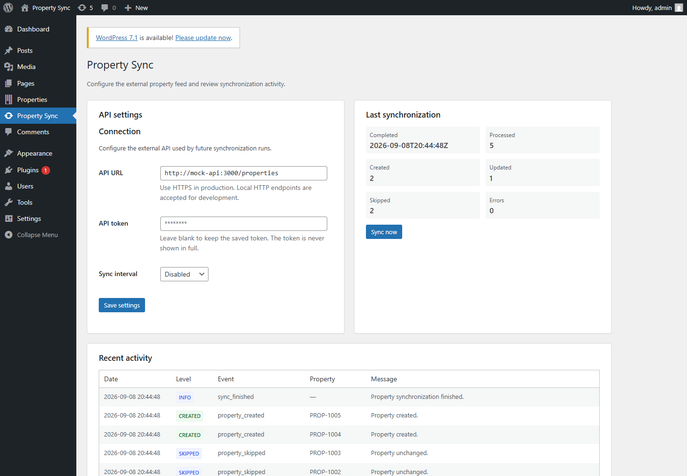
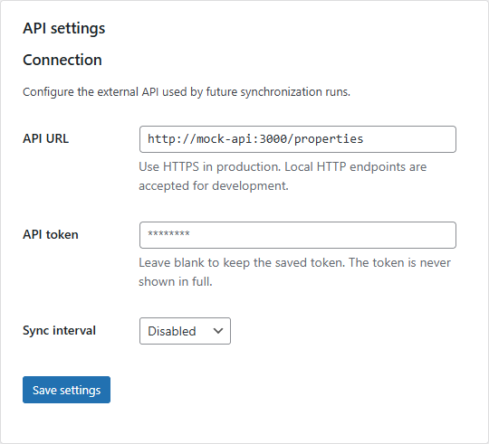
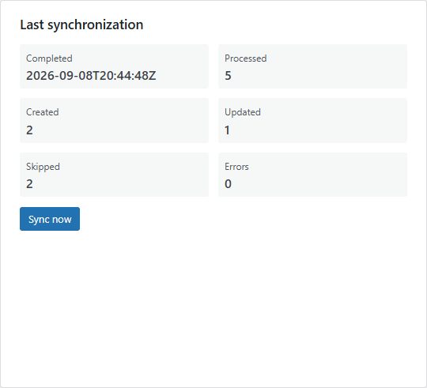
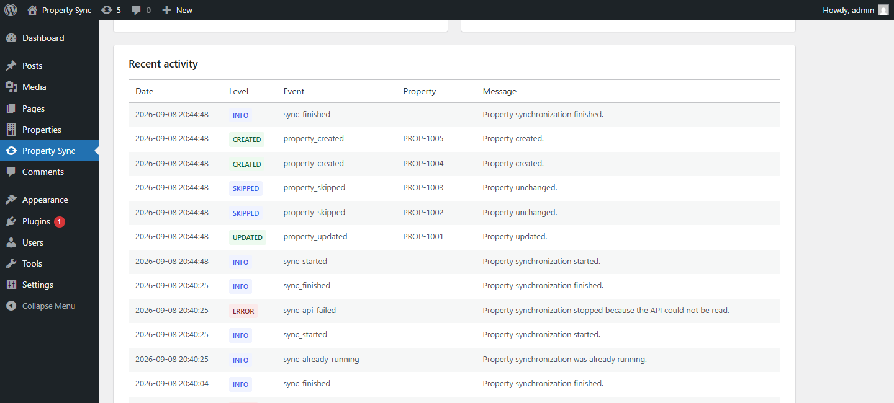

# Property Sync API

[](https://github.com/andreynzz/Property-sync-API/actions/workflows/quality.yml)


[](LICENSE)

A production-minded WordPress plugin that synchronizes real-estate listings
from an external REST API with idempotent updates, WP-Cron, structured logs,
Docker, tests, and CI.



## Overview

Property Sync API imports a paginated property feed into a public WordPress
`property` custom post type. It validates upstream data, maps taxonomies and
metadata, detects real content changes, and gives administrators one place to
configure, run, and audit synchronization.

The project favors WordPress-native APIs and explicit component boundaries over
framework-heavy infrastructure. It remains small enough to understand quickly
while covering the failure, security, and concurrency concerns expected from a
real integration.

## Why this project exists

Real-estate companies often keep property data in external CRMs or management
systems while using WordPress as their public website. Keeping both systems in
sync manually is slow, error-prone, and creates duplicate or stale listings.

Property Sync API demonstrates how an external feed can be imported safely
while avoiding duplicate posts and unnecessary database writes.

## Features

- Public `property` CPT with a `/properties/` archive and REST-enabled property
  type, city, and status taxonomies.
- Authenticated, paginated REST client with response validation, a 15-second
  timeout, redirect limit, and page limit.
- Canonical normalization and SHA-256 change detection for idempotent create,
  update, and skip behavior.
- Explicit duplicate external-ID detection and isolated validation/persistence
  failures per listing.
- Administrator dashboard with secure settings, masked token, manual sync,
  last-run counters, and recent activity.
- Native WP-Cron schedules and a 15-minute concurrency lock with stale-lock
  recovery and ownership-safe release.
- Structured logging with secret redaction and a 30-day / 5,000-row retention
  policy.
- Reproducible Docker environment, PHPUnit, WordPress smoke tests, PHPCS,
  PHPCompatibility, and GitHub Actions.

## Architecture

```text
Admin POST / WP-Cron
         |
         v
     SyncRunner
      |-- SyncLock
      |-- PropertyApiClient
      |-- PropertyNormalizer
      |-- PropertyHasher
      |-- PropertyRepository
      `-- SyncLogger
```

`Plugin` is the composition root and wires concrete dependencies explicitly.
Each component owns one integration concern; there is no service container,
queue, or repository abstraction without a concrete need. See
[docs/architecture.md](docs/architecture.md) for the complete design and data
model.

## Synchronization flow

1. A manual action or WP-Cron invokes the same `SyncRunner` use case.
2. The runner acquires an atomic lock and creates a run ID.
3. The API client reads and validates every page.
4. Each listing is normalized and fingerprinted from its canonical content.
5. The repository finds the post by exact external ID, then creates, updates,
   or skips it according to the SHA-256 hash.
6. Counters and structured events are stored before the lock is released in
   `finally`.

An invalid listing or known persistence rejection increments the error counter
and does not block later valid items. API-level failures and unexpected
programming errors abort the run; unexpected errors are logged without a stack
trace or sensitive payload and are rethrown instead of being silently hidden.

## Engineering decisions

### Idempotent synchronization

The external ID selects the WordPress post. A stable hash of recursively sorted
canonical content determines whether a write is necessary; upstream
`updated_at` remains audit data rather than the only change signal.

### Concurrency protection

An atomic, non-autoloaded WordPress option prevents overlapping runs. Its
15-minute TTL allows recovery after an interrupted process, and only the owner
token can release it.

### Failure isolation

Malformed payloads and known WordPress persistence failures are isolated per
listing. `TypeError`, `Error`, and other unexpected failures propagate after a
safe diagnostic event is recorded, making programming defects visible.

### WordPress-native scheduling

Native `hourly`, `twicedaily`, and `daily` WP-Cron intervals keep deployment
simple. Because WP-Cron depends on site traffic, time-critical installations
should trigger `wp-cron.php` from a system scheduler.

### Scope control

Missing upstream listings are not deleted, and image URLs are stored without
sideloading. Both choices avoid destructive or storage-heavy behavior until a
real product requirement defines the policy.

## Screenshots

### Connection settings

The stored API token is never rendered back to the browser.



### Synchronization result

This real demo run processed five listings: two created, one updated, two
unchanged, and no errors.



### Structured activity log

Events expose operational outcomes and external IDs without storing tokens,
authorization headers, or raw payloads.



## Quick start

### Requirements

- Docker and Docker Compose
- Git

PHP and Composer are provided through Docker, so neither is required on the
host machine.

1. Create the local environment file:

   ```bash
   cp .env.example .env
   ```

2. Start the services:

   ```bash
   docker compose up -d
   ```

3. Install WordPress, configure rewrites, and activate the plugin:

   ```bash
   docker compose run --rm wpcli wp core install --url=http://localhost:8080 --title="Property Sync" --admin_user=admin --admin_password=admin --admin_email=admin@example.com --skip-email
   docker compose run --rm wpcli wp rewrite structure '/%postname%/' --hard
   docker compose run --rm wpcli wp plugin activate property-sync
   ```

Open <http://localhost:8080/wp-admin/>, sign in with `admin` / `admin`, and
choose **Property Sync**. These credentials are for local development only.

## Configuration

Use the bundled deterministic feed with:

```text
API URL: http://mock-api:3000/properties
API token: demo-token
Sync interval: Disabled (or a native WP-Cron interval)
```

The API is also available from the host at
<http://localhost:3001/properties>. Its payload contract and deterministic
failure scenarios are documented in
[docs/api-contract.md](docs/api-contract.md).

For a deployed environment, define the token outside the database:

```php
define( 'PROPERTY_SYNC_API_TOKEN', 'replace-with-a-secret' );
```

The constant takes precedence and makes the admin token field read-only.

## Security

- Settings and manual runs require `manage_options`; the manual POST action
  also verifies a nonce and redirects after processing.
- Production API endpoints require HTTPS. HTTP is limited to known local
  development hosts.
- Saved tokens use a non-autoloaded option, stay masked in the UI, and are
  excluded from logs together with credential-shaped context.
- Input is validated or sanitized at its boundary, output is escaped when
  rendered, and HTTP/page limits constrain external work.
- Internal property metadata is not exposed automatically through REST.

## Development

```bash
docker compose ps
docker compose logs -f wordpress
docker compose run --rm composer-install validate --strict
docker compose run --rm composer-install check
docker compose run --rm composer-install lint:fix
docker compose run --rm wpcli wp plugin status property-sync
```

Do not run `docker compose down -v` unless you intentionally want to remove the
local database and uploads. Plain `docker compose down` keeps them.

## Tests

The unit suite covers pure normalization and hashing behavior. Integration
smoke scripts exercise the WordPress content model, API client, persistence,
create/update/skip behavior, expected failure isolation, unexpected error
propagation, logs, manual action, cron, and lock release.

```bash
docker compose run --rm composer-install check

docker compose run --rm wpcli wp eval-file wp-content/plugins/property-sync/tests/Smoke/content-model.php
docker compose run --rm wpcli wp eval-file wp-content/plugins/property-sync/tests/Smoke/admin-settings.php
docker compose run --rm wpcli wp eval-file wp-content/plugins/property-sync/tests/Smoke/api-client.php
docker compose run --rm wpcli wp eval-file wp-content/plugins/property-sync/tests/Smoke/api-client-mock.php
docker compose run --rm wpcli wp eval-file wp-content/plugins/property-sync/tests/Smoke/property-normalization.php
docker compose run --rm wpcli wp eval-file wp-content/plugins/property-sync/tests/Smoke/property-sync.php
docker compose run --rm wpcli wp eval-file wp-content/plugins/property-sync/tests/Smoke/sync-logging.php
docker compose run --rm wpcli wp eval-file wp-content/plugins/property-sync/tests/Smoke/manual-sync-dashboard.php
docker compose run --rm wpcli wp eval-file wp-content/plugins/property-sync/tests/Smoke/cron-and-lock.php
```

GitHub Actions runs Composer install, PHPCS, and PHPUnit for pull requests and
pushes to `develop` and `main`.

## Project workflow

```text
feature/* or fix/*
        |
        v
     develop  -- CI and integration
        |
        v
       main   -- tagged semantic releases
```

Future maintenance uses focused branches, Conventional Commits, pull requests,
and the existing lightweight issue/PR templates. The project history is kept
authentic; no retrospective issues or pull requests are manufactured.

Release descriptions follow [docs/release-template.md](docs/release-template.md).

## Scope and roadmap

The MVP intentionally excludes automatic deletion of missing listings, image
sideloading, CSV export, custom cron intervals, WP-CLI commands, incremental
cursors, queues, Redis, multisite, GraphQL, webhooks, and bidirectional sync.
These are possible follow-ups only when a concrete production requirement
justifies their complexity.

## Portfolio context

This project demonstrates a production-minded WordPress integration, with
emphasis on maintainability, safe synchronization, failure handling, testing,
and professional development practices rather than UI complexity.

## License

Copyright (c) 2026 Andrey da Hora Pirola.

This project is licensed under [GPL-2.0-or-later](LICENSE). You may use,
modify, and redistribute it under the GNU General Public License, version 2 or
any later version published by the Free Software Foundation.
